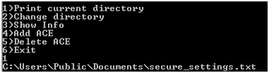
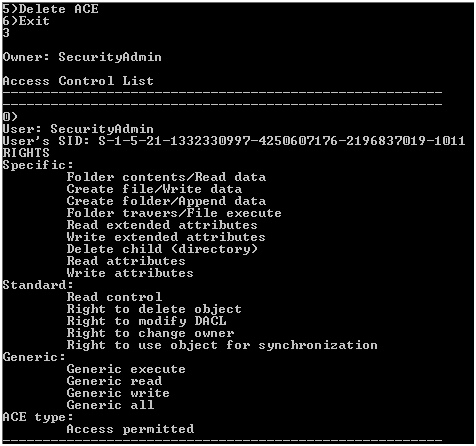

# Windows_Access_Control
Консольная программа по исследованию механизмов контроля доступа Windows с функциями:
1. Отображение владельца;
2. Отображение списков доступа (ACL);
3. Добавление/изменение записей ACL.

